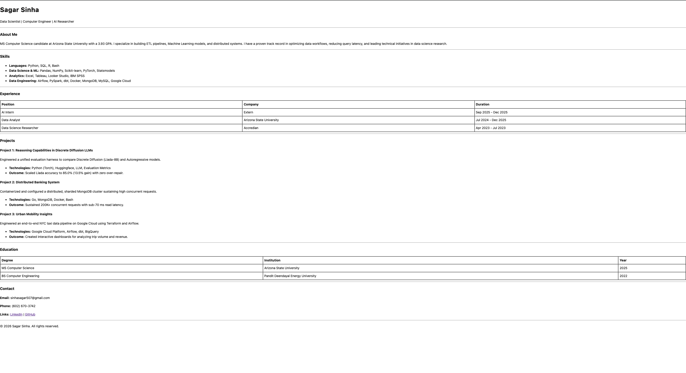

# HTML Resume - Sagar Sinha

## Project Description
This project is a single-page personal resume website built entirely using **semantic HTML5**. 

Created as part of the **Web Dev Cohort 2026** assignment, the goal is to replicate a specific linear document layout without relying on CSS for styling. It demonstrates mastery of core HTML elements including tables, lists, horizontal rules, and semantic document structure.


## Features
* **Semantic Structure:** Uses `<header>`, `<section>`, and `<footer>` for proper document outlining.
* **Data Tables:** Professional formatting of Education and Experience history using HTML `<table>` elements with borders.
* **Linear Layout:** Follows a specific top-to-bottom flow using `<hr>` tags for visual separation.
* **Zero CSS:** Pure HTML implementation focusing on raw content structure and browser default rendering.

## Setup & Usage

Since this project uses only HTML, no complex installation or package manager is required.

### Prerequisites
* A modern web browser (Chrome, Firefox, Safari, Edge).
* A text editor (VS Code, Notepad, etc.) if you wish to edit the code.

### Installation Steps
1.  **Clone the repository:**
    ```bash
    git clone [https://github.com/sinhasagar507/html-resume.git](https://github.com/sinhasagar507/html-resume.git)
    ```
2.  **Navigate to the folder where the `index.html` file is located:**
   
3.  **Open the file:**
    * Locate `index.html` in the folder.
    * Double-click the file to open it in your default web browser.

## Screenshots


### Full Page Preview
*(Add a screenshot of your full resume page here. You can drag and drop an image into your GitHub README editor to generate a link)*


### Experience Table Detail
*(Optional: Zoomed in view of the table structure)*


## Project Structure
```text
/
├── index.html       # The main HTML file containing the resume
├── README.md        # Project documentation
└── images           # Consists of output resume screenshot images