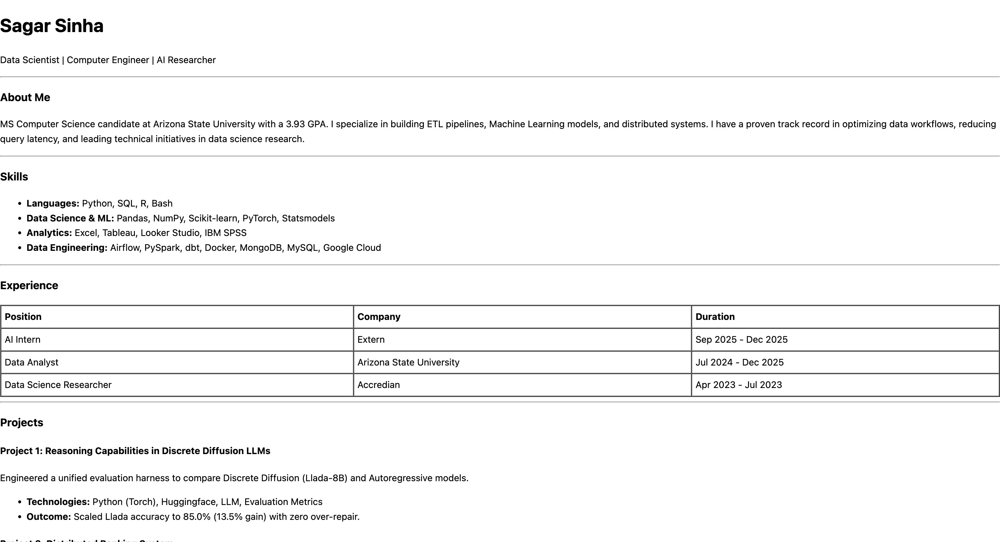
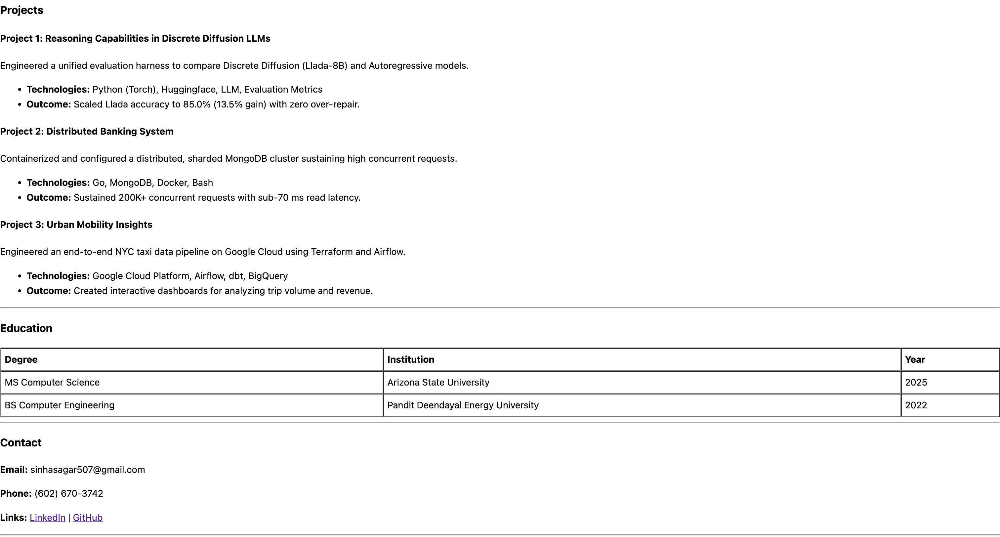

# HTML Resume - Sagar Sinha

## Project Description
This project is a single-page personal resume website built entirely using **semantic HTML5**. 

Created as part of the **Web Dev Cohort 2026** assignment, the goal is to replicate a specific linear document layout without relying on CSS for styling. It demonstrates mastery of core HTML elements including tables, lists, horizontal rules, and semantic document structure.

---

## Features
* **Semantic Structure:** Uses `<header>`, `<section>`, and `<footer>` for proper document outlining.
* **Data Tables:** Professional formatting of Education and Experience history using HTML `<table>` elements.
* **Linear Layout:** Follows a specific top-to-bottom flow using `<hr>` tags for visual separation.
* **Zero CSS:** Pure HTML implementation focusing on raw content structure and browser default rendering.

---

## Setup & Usage

Since this project uses only HTML, no complex installation or package manager is required.

### Prerequisites
* A modern web browser (Chrome, Firefox, Safari, Edge).
* A text editor (VS Code, Cursor, etc.) if you wish to edit the code.

### Installation Steps
1. **Clone the repository and navigate to the folder:**

```bash
# Clone the repository
git clone https://github.com/sinhasagar507/web-dev-cohort-2026.git

# Move into the specific assignment directory
cd web-dev-cohort-2026/assignments/assignment-1
```

2. **Open the file:**
   * Locate `index.html` in the folder.
   * Double-click the file or right-click and select **"Open with Browser"**.

---

## Screenshots

<figure align="center">
  
</figure>

<br>

<figure align="center">
  
</figure>

### Full Page Preview


---

## Project Structure
```text
/assignment-1
├── index.html       # The main HTML file containing the resume
├── README.md        # Project documentation
└── images/          # Screenshots of the final output
```

---

## Author
**Sagar Sinha**
