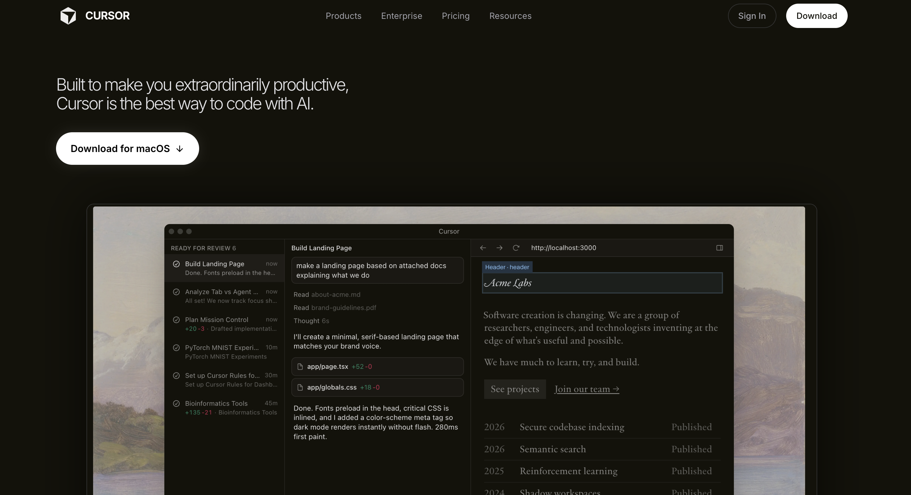
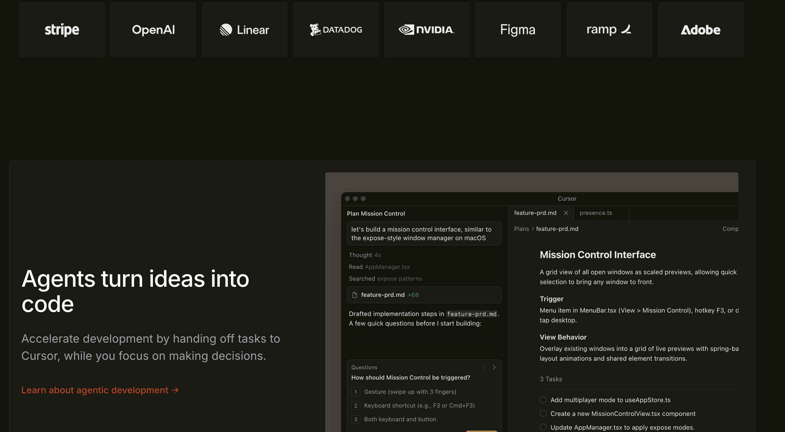
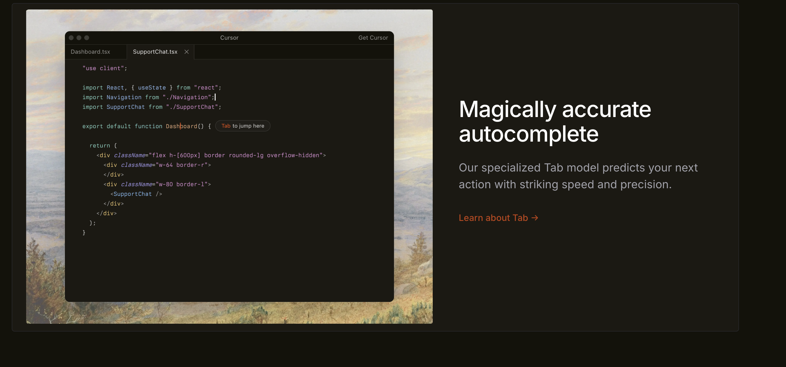
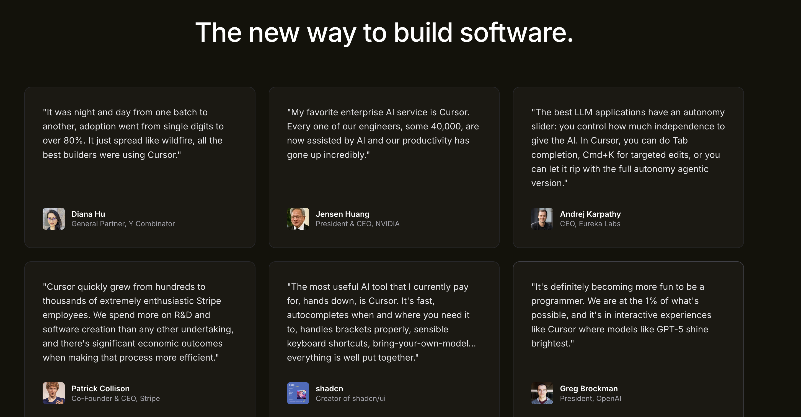
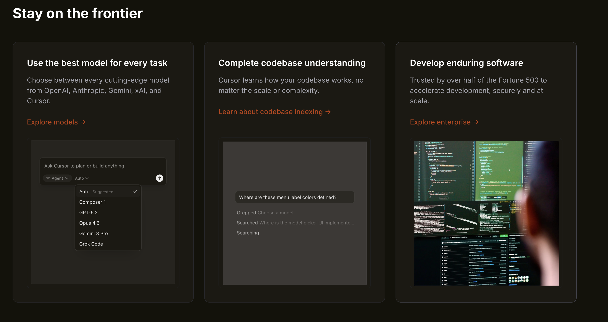
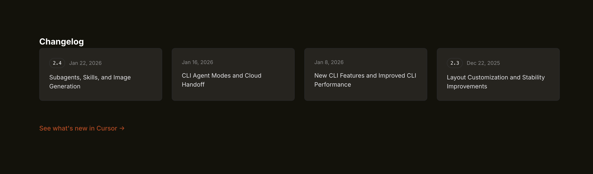
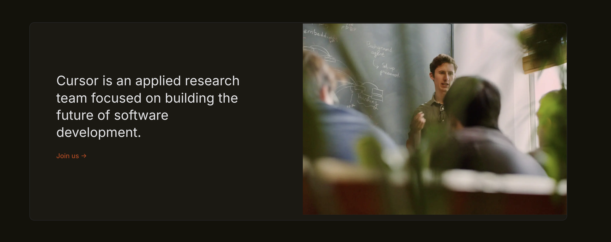
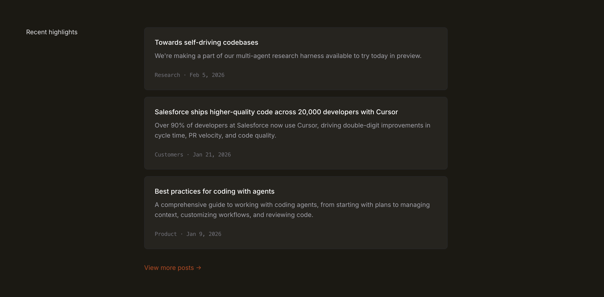
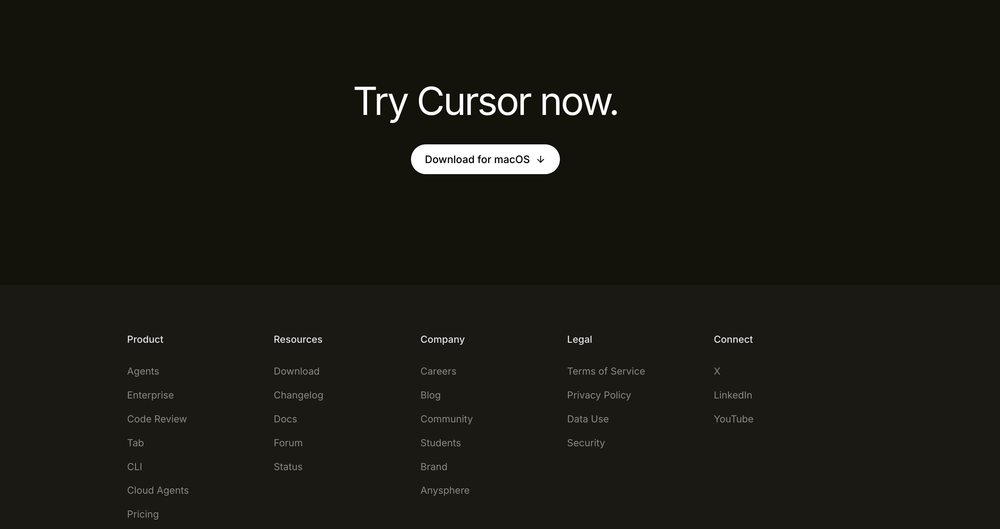

# Cursor Landing Page Replica

A frontend replica of the Cursor AI code editor website, built with vanilla HTML and CSS as part of the Web Dev Cohort 2026 assignment.

## Project Hosting Details 

Used Netlify to host the project at the URL: https://cursorlandpage.netlify.app/

## Project Overview

This project recreates the structure and design of the Cursor website (https://cursor.com/) focusing on:
- Desktop-first responsive design
- Dark theme with professional developer aesthetics
- Clean, modern UI matching the original
- Semantic HTML structure
- Pure CSS styling (no frameworks)

## Sections Recreated

### Completed Sections

1. **Top Navigation Bar**
   - Cursor logo with dark theme
   - Navigation links (Products, Enterprise, Pricing, Resources)
   - Primary CTA buttons (Sign In, Download)
   - Fixed positioning with backdrop blur effect
   - Dark background matching original

2. **Hero Section**
   - Main headline: "The AI-First Code Editor"
   - Descriptive subtitle about AI-powered coding
   - Primary CTA button (Download)
   - Large product screenshot/demo image
   - Grid background pattern for visual depth

3. **Trusted By / Company Logos**
   - Row of company logos using Cursor's partners
   - Professional logo grid layout
   - Subtle hover effects

4. **Feature Sections (3 blocks)**
   - Two-column layout alternating text and images
   - Feature 1: AI-powered code completion
   - Feature 2: Chat with your codebase
   - Feature 3: Instant code generation
   - Alternating image/text positions for visual variety

5. **Feature Cards Section**
   - Section title: "Why Developers Choose Cursor"
   - Grid of 4 feature cards with icons
   - Cards highlighting key capabilities
   - Hover effects and professional styling

6. **Testimonials**
   - Developer testimonials with quotes
   - Name, role, and company information
   - Professional card-based layout
   - Real developer feedback styling

7. **Use Cases / Stories**
   - Cards with images and descriptions
   - Different development scenarios
   - Visual storytelling approach
   - Professional case study layout

8. **Changelog / Updates**
   - List of recent updates with dates
   - Version information and features
   - Clean, organized timeline layout
   - Developer-focused update descriptions

9. **Team / About Section**
   - Large team image
   - Company description and mission
   - Call-to-action for careers/contact
   - Professional about section styling

10. **Final Call-to-Action**
    - Strong heading: "Start coding with AI today"
    - Single prominent download button
    - Conversion-focused design

11. **Footer**
    - Multi-column navigation links
    - Company information and legal links
    - Social media links
    - Professional footer structure

## Design Specifications

### Colors Used

- **Primary Background**: `rgb(19, 18, 10)` - Dark brown/black
- **Surface Background**: `#0a0a0a` - Pure black for cards
- **Surface Hover**: `#111111` - Subtle hover state
- **Primary Text**: `#ffffff` - Pure white
- **Secondary Text**: `#a1a1aa` - Light gray
- **Muted Text**: `#666666` - Darker gray
- **Accent Blue**: `#3b82f6` - Primary blue for CTAs
- **Border Color**: `#1f1f1f` - Dark borders
- **Border Light**: `#333333` - Lighter borders

### Fonts Used

- **Primary Font**: Inter (Google Fonts)
- **Weights**: 300, 400, 500, 600, 700
- **Monospace**: Menlo, Monaco, Courier New (for code)
- **Fallbacks**: system-ui, -apple-system, sans-serif

### Layout Specifications

- **Container Max Width**: 1300px
- **Header Height**: 70px
- **Section Spacing**: 100px vertical padding
- **Grid System**: CSS Grid for major layouts
- **Responsive Breakpoints**: Desktop-first approach

## Technical Implementation

### HTML Structure

- Semantic HTML5 elements
- Proper heading hierarchy (h1-h3)
- Accessible navigation with ARIA labels
- Skip-to-content link for accessibility
- Proper alt text for images

### CSS Features

- CSS Custom Properties (CSS Variables) for theming
- CSS Grid for complex layouts
- Flexbox for component alignment
- Backdrop blur effects for modern aesthetics
- Hover effects and transitions
- Focus states for accessibility
- Modern CSS reset

### Accessibility Features

- Skip-to-content navigation
- Proper focus states
- ARIA labels for navigation
- Semantic markup structure
- High contrast color scheme

## Getting Started

### Prerequisites

- Bun runtime installed
- Modern web browser

### Installation

Follow these steps to set up your environment and launch the development server using **Bun** and **Vite**.

1. Navigate to the assignment directory:
```bash
cd assignments/assignment-2
```

2. Install dependencies:
```bash
bun install
```

3. Start the development server:
```bash
bun run dev
```

### Alternative Serving Methods

Using Python:
```bash
python3 -m http.server 3000
```

Using Node.js:
```bash
npx serve .
```

## Project Structure

```
assignment-2/
├── index.html              # Main HTML file
├── src/
│   └── style.css          # Main stylesheet (1100+ lines)
├── public/                # Images and assets  
│   
├── package.json           # Project configuration
├── README.md             # This file
└── bun.lock             # Dependency lock file
```

## Assignment Requirements Met

- **Desktop-first design** - Optimized for desktop viewing
- **HTML and CSS only** - No JavaScript frameworks
- **No TailwindCSS** - Pure CSS implementation
- **Structural accuracy** - Matches Cursor's layout
- **Dark theme implementation** - Professional developer aesthetic
- **All 11 sections** - Complete website structure
- **Typography matching** - Inter font family
- **Color palette accuracy** - Dark theme with blue accents
- **Visual hierarchy** - Proper spacing and organization
- **Clean HTML** - Semantic structure
- **Professional images** - Cursor-style graphics and screenshots

## Key Visual Elements

### Header
- Fixed navigation with backdrop blur
- Cursor logo with dark theme
- Professional navigation structure

### Hero Section
- Large, impactful headline
- Product screenshot prominence
- Grid background pattern
- Strong call-to-action

### Feature Sections
- Alternating layout pattern
- High-quality product images
- Clear feature descriptions
- Professional spacing

### Developer Focus
- Code-centric imagery
- Developer testimonials
- Technical feature highlights
- Professional development workflow

## Development Notes

### Browser Compatibility
- Modern browsers (Chrome 90+, Firefox 88+, Safari 14+)
- CSS Grid and Flexbox support required
- CSS backdrop-filter support for navigation blur

### Performance Considerations
- Optimized CSS with custom properties
- Efficient use of CSS Grid and Flexbox
- Minimal external dependencies (only Google Fonts)
- Optimized image loading

## Future Enhancements

- Add smooth scroll animations
- Implement interactive code demos
- Enhanced mobile responsiveness
- Dark/light mode toggle
- Loading animations
- Advanced accessibility features 

## App Screenshots










## Learning Outcomes

This project demonstrates:
- Advanced CSS Grid and Flexbox layouts
- Dark theme design principles
- Professional developer tool aesthetics
- Semantic HTML structure
- Modern CSS techniques (custom properties, backdrop-filter)
- Accessibility best practices
- Clean, maintainable code structure
