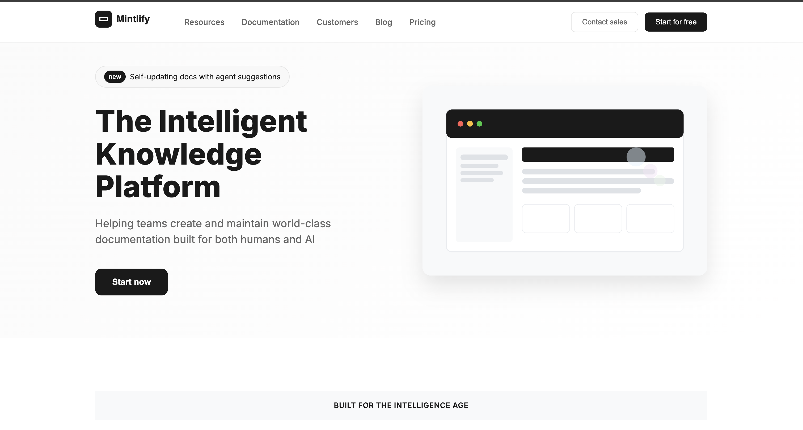
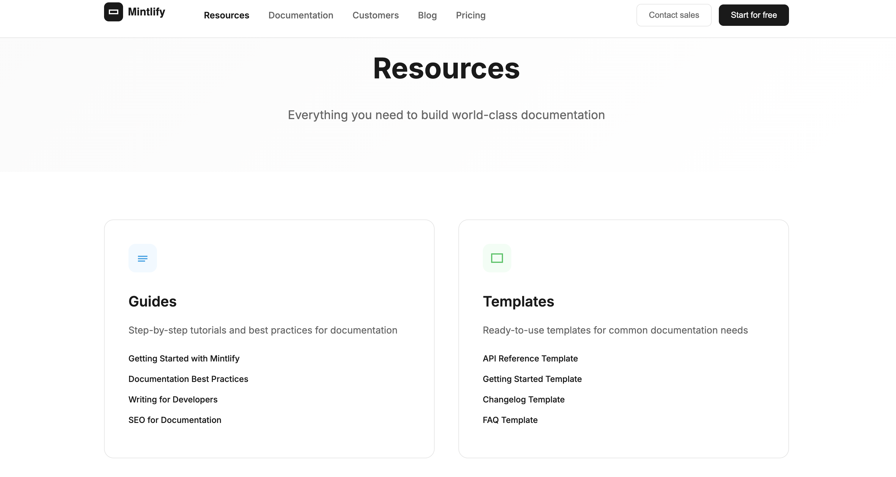
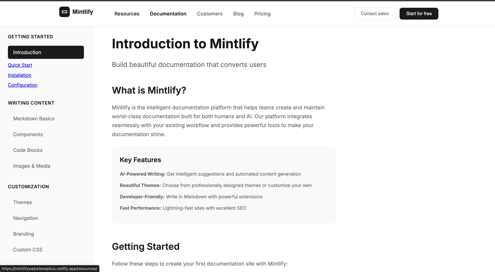
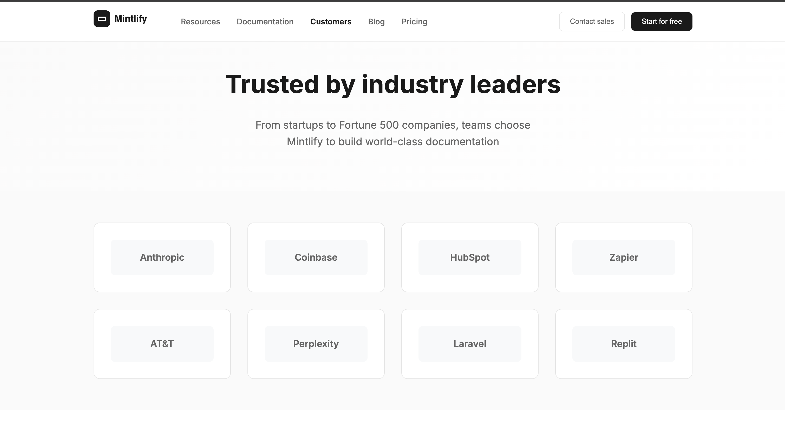
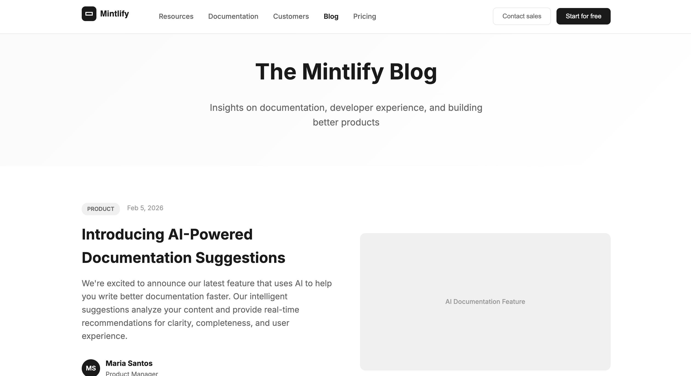
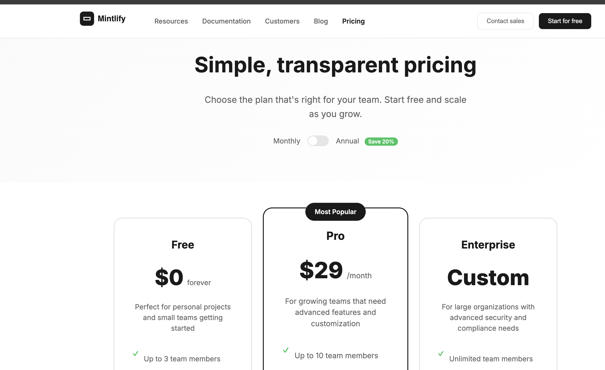

# Mintlify Website Replica

A frontend replica of the Mintlify documentation platform website, built with vanilla HTML and CSS as part of the Web Dev Cohort 2026 assignment.

## Project Hosting

Used Netlify to host the project at the URL: https://mintlifywebsitereplica.netlify.app/

## Project Overview

This project recreates the structure and design of the Mintlify website (https://www.mintlify.com/) focusing on:
- Desktop-first responsive design
- Clean, modern UI matching the original
- Semantic HTML structure
- Pure CSS styling (no frameworks)
- Professional documentation website layout

## Complete Website Structure

### Main Homepage (index.html)



1. **Top Navigation Bar**
   - Mintlify logo with proper SVG
   - Navigation links to all pages (Resources, Documentation, Customers, Blog, Pricing)
   - Primary CTA buttons (Contact sales, Start for free)
   - Fixed positioning with backdrop blur

2. **Hero Section**
   - Main headline with "new" badge
   - Descriptive subtitle
   - Primary CTA button
   - Custom hero illustration (SVG)
   - Two-column grid layout

3. **Intelligence Features Section**
   - "Built for the intelligence age" heading
   - Three feature cards with icons and descriptions
   - Hover effects and professional styling

4. **Enterprise Section**
   - Two-column layout with features
   - Partnership and compliance information
   - Call-to-action button

5. **Customer Story Highlight**
   - Anthropic case study with statistics
   - Professional card design
   - Metrics display

6. **Trusted By Section**
   - Company logos (all created as SVGs)
   - Responsive logo grid

7. **Customer Stories Grid**
   - Six customer story cards
   - Company branding and descriptions
   - Professional card layout

8. **Final Call-to-Action**
   - Centered design with gradient background
   - Multiple CTA options

9. **Footer**
   - Five-column navigation structure
   - Security badges and compliance info
   - Copyright and company information

### Resources Page (/resources/index.html)



- **Resource Categories**: Guides, Templates, Developer Tools, Community
- **Popular Resources**: Featured articles and downloads
- **Newsletter Signup**: Email subscription form
- **Category Cards**: Interactive hover effects with resource lists

### Documentation Page (/documentation/index.html)



- **Documentation Layout**: Sidebar navigation + main content
- **Sidebar Navigation**: Organized by sections (Getting Started, Writing Content, etc.)
- **Main Content**: Introduction, step-by-step guides, code examples
- **Interactive Elements**: Code blocks, step-by-step instructions
- **Next Steps**: Action cards for further learning

### Customers Page (/customers/index.html)



- **Customer Logos Grid**: 8+ company logos
- **Featured Case Study**: Anthropic spotlight with metrics
- **Case Studies Grid**: 6 detailed customer stories with tags
- **Testimonials**: Customer quotes with author information
- **Customer CTA**: Trial and demo options

### Blog Page (/blog/index.html)



- **Featured Article**: Large highlighted blog post
- **Category Navigation**: Filterable blog categories
- **Blog Posts Grid**: 6 blog posts with metadata
- **Newsletter Signup**: Subscription with disclaimer
- **Author Information**: Avatar and author details

### Pricing Page (/pricing/index.html)



- **Billing Toggle**: Monthly/Annual with discount badge
- **Three Pricing Tiers**: Free, Pro (featured), Enterprise
- **Feature Comparison Table**: Detailed feature breakdown
- **FAQ Section**: Common pricing questions
- **Pricing CTA**: Multiple conversion options

## Design Specifications

### Fonts
- **Primary Font**: Inter (Google Fonts)
- **Weights Used**: 300, 400, 500, 600, 700, 800
- **Fallbacks**: -apple-system, BlinkMacSystemFont, 'Segoe UI', Roboto, sans-serif

### Colors
- **Primary Text**: #1a1a1a
- **Secondary Text**: #666
- **Background**: #ffffff
- **Accent Background**: #fafafa
- **Borders**: #e5e5e5
- **Button Primary**: #1a1a1a
- **Button Hover**: #333

### Layout
- **Max Width**: 1200px
- **Grid System**: CSS Grid for major layouts
- **Spacing**: Consistent 8px grid system
- **Border Radius**: 8px, 12px, 16px, 20px for different elements

## 🛠 Technical Implementation

### HTML Structure
- Semantic HTML5 elements
- Proper heading hierarchy (h1-h4)
- Accessible button and link elements
- Grid and flexbox layouts

### CSS Features
- CSS Grid for complex layouts
- Flexbox for component alignment
- CSS Custom Properties for consistent spacing
- Hover effects and transitions
- Backdrop blur for navigation
- Gradient backgrounds

### Responsive Design
- Desktop-first approach (1200px+ optimal)
- Tablet breakpoint (1024px)
- Mobile breakpoint (768px)
- Flexible grid systems

## Getting Started

### Prerequisites
- Bun runtime installed
- Modern web browser

### Installation

1. Clone the repository:
```bash
git clone https://github.com/sinhasagar507/web-dev-cohort-2026.git
cd web-dev-cohort-2026/assignments/assignment-3
```

2. Install dependencies:
```bash
bun install
```

3. Start the development server:
```bash
bun run serve
```

4. Open your browser and navigate to:
```
http://localhost:3000
```

### Alternative Serving Methods

Using Python:
```bash
python3 -m http.server 3000
```

Using Node.js (if available):
```bash
npx serve .
```

## 📁 Project Structure

```
assignment-3/
├── index.html                    # Homepage
├── resources/
│   └── index.html               # Resources page
├── documentation/
│   └── index.html               # Documentation page  
├── customers/
│   └── index.html               # Customers page
├── blog/
│   └── index.html               # Blog page
├── pricing/
│   └── index.html               # Pricing page
├── src/
│   └── style.css                # Complete stylesheet for all pages
├── public/
│   ├── logos and images        # Site favicon
├── package.json                 # Project configuration
├── README.md                    # This documentation
└── bun.lock                     # Dependency lock file
```

## Assignment Requirements Met

- Desktop-first design
- HTML and CSS only (no JavaScript)
- No TailwindCSS or frameworks
- Structural accuracy to original
- Professional typography and spacing
- Consistent color scheme
- Hover effects and interactions
- Semantic HTML structure
- Clean, maintainable CSS

## Assets Needed

The project references several image assets that would need to be obtained:

### Brand Logos
- Mintlify logo
- Company logos (Anthropic, Coinbase, HubSpot, etc.)
- Customer logos (Perplexity, X, Kalshi, etc.)

### Illustrations
- Hero section illustration
- Customer story backgrounds
- Security compliance badges

*Note: In this replica, placeholder references are used. In a production environment, proper brand assets would be obtained through official channels.*

## Development Notes

### Browser Compatibility
- Modern browsers (Chrome 90+, Firefox 88+, Safari 14+)
- CSS Grid and Flexbox support required
- CSS backdrop-filter support for navigation

### Performance Considerations
- Optimized CSS with minimal redundancy
- Efficient use of CSS Grid and Flexbox
- Minimal external dependencies (only Google Fonts)

## Future Enhancements

- Add proper image assets
- Implement smooth scroll navigation
- Add loading animations
- Enhanced mobile responsiveness
- Dark mode toggle
- Accessibility improvements (ARIA labels, focus states)

## Learning Outcomes

This project demonstrates:
- Advanced CSS Grid and Flexbox layouts
- Professional web design principles
- Responsive design implementation
- Clean, semantic HTML structure
- Modern CSS techniques (backdrop-filter, gradients, transitions)
- Project organization and documentation