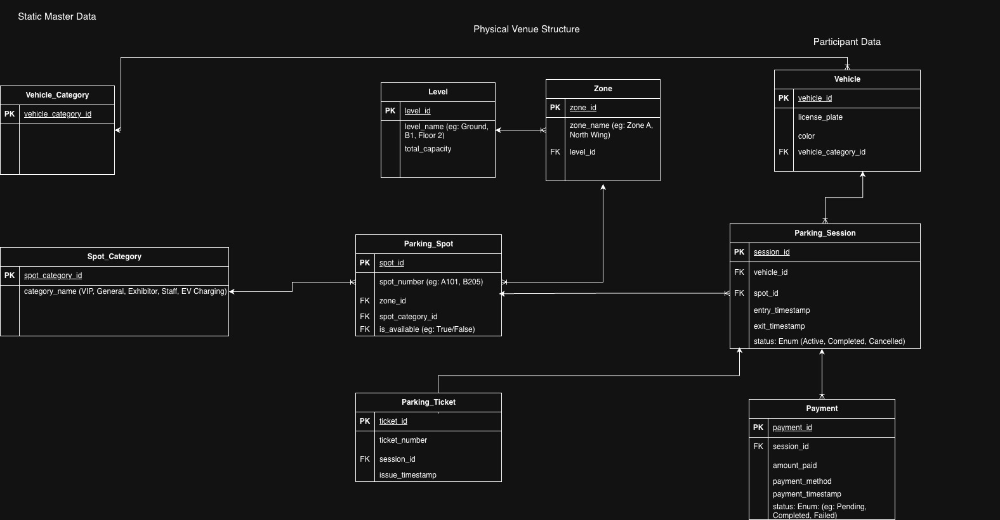

# Comic-Con India: Multi-Zone Event Parking System

This repository contains the database design for a specialized parking management system tailored for high-volume events like Comic-Con India. The architecture is designed to manage diverse vehicle types, reserved parking for VIPs and exhibitors, and multi-day visitor tracking.

---

## Schema 

## System Overview

The schema is divided into four logical modules to ensure high normalization and data integrity:
1. **Static Master Data:** Defines categories for vehicles and parking spots.
2. **Physical Venue Structure:** Models the hierarchical layout of the facility (Levels > Zones > Spots).
3. **Participant Data:** Maintains unique records for every vehicle entering the premises.
4. **Transactional Data:** Tracks the lifecycle of a parking event, from entry to payment and exit.

---

## Entity Definitions

### 1. Static Master Data
* **Vehicle_Category:** Stores classifications like Bike, Car, SUV, Cab, and EV. This allows the system to validate if a vehicle fits in a specific spot.
* **Spot_Category:** Defines special access rules. Categories include General, VIP, Exhibitor, Staff, Cosplayers (with props), and EV Charging.

### 2. Physical Venue Structure
* **Level:** Represents the vertical floor (e.g., Ground, B1, Floor 2). It tracks total capacity for high-level availability reporting.
* **Zone:** Represents a specific area on a level (e.g., Zone A, North Wing). This creates a manageable sub-structure for navigation.
* **Parking_Spot:** The individual stall. Each spot is linked to a Zone and a Spot_Category. It contains an `is_available` flag for real-time tracking.

### 3. Participant Data
* **Vehicle:** Stores the license plate and color. By separating this from the session, the system recognizes a vehicle if it visits multiple times across different days.

### 4. Transactional Data
* **Parking_Session:** The core "event" table. It links a Vehicle to a Spot and records `entry_timestamp` and `exit_timestamp`.
* **Parking_Ticket:** Linked to the session, this stores the unique ticket number generated upon entry.
* **Payment:** Handles financial records. It is linked to the session in a 1:M relationship to support split payments or multiple transaction attempts.

---

## Relationship Logic & Business Rules

### Multi-Day Visits and Spot Reuse
* **One-to-Many (Vehicle to Session):** A single vehicle can have multiple parking sessions. This supports the requirement where a visitor attends the event on multiple days.
* **One-to-Many (Spot to Session):** A parking spot is not "owned" by a vehicle. Once a session ends, the spot is marked available and can be reused in a new session by a different vehicle.

### Hierarchical Allocation
* **Level > Zone > Spot:** This hierarchy ensures that the system can report availability at any grain—from the entire building down to a specific row in a specific wing.

### Financial Flexibility
* **One-to-Many (Session to Payment):** This structure allows a single parking stay to have multiple payment records. This is critical for handling split payments (e.g., part cash, part card) or documenting failed transaction attempts for audit purposes.

---

## Answering Key Business Questions

| Question | Database Implementation Logic |
| :--- | :--- |
| **What vehicles are currently parked?** | Filter `Parking_Session` where `exit_timestamp` is NULL. |
| **What type of vehicle entered?** | Join `Vehicle` with `Vehicle_Category` via `vehicle_category_id`. |
| **Was the spot reserved for VIP/Staff?** | Check the `Spot_Category` linked to the assigned `Parking_Spot`. |
| **Which zone/level does a spot belong to?** | Trace the `zone_id` from the spot to the `Zone` table, then to `Level`. |
| **How is availability tracked?** | Calculate total spots in a `Zone` minus active `Parking_Sessions`. |
| **When did the vehicle enter/exit?** | Recorded in the `entry_timestamp` and `exit_timestamp` of the `Parking_Session`. |
| **Can a vehicle visit multiple times?** | Yes, the `vehicle_id` will appear in multiple `Parking_Session` rows. |

---

## Technical Features
* **Referential Integrity:** Foreign Keys (FK) ensure that a session cannot exist without a valid vehicle and spot.
* **Audit Trail:** The separation of Tickets, Sessions, and Payments provides a full history of every interaction for management review.
* **Scalability:** The hierarchical venue structure allows for additional zones or levels to be added without modifying the underlying table logic.
